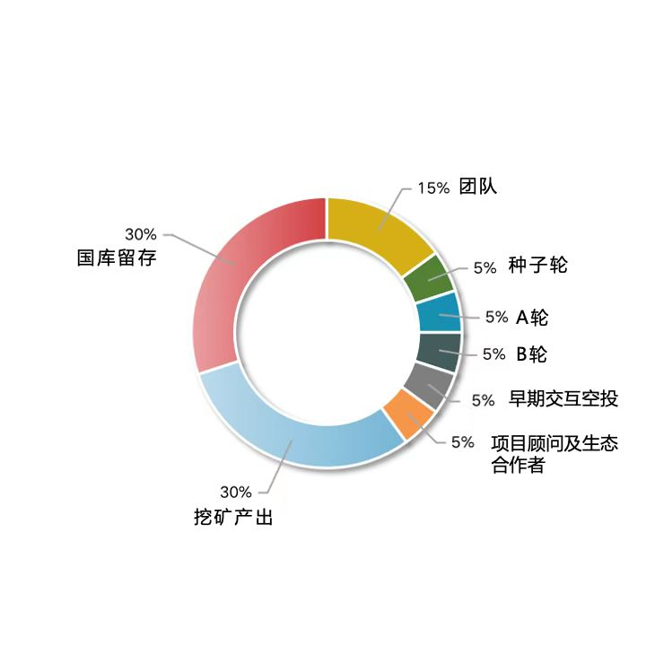

# 代币分配与经济学

Meta Defender的项目代币为DEF，它的分配计划如下图所示：


"挖矿产出"是DeFi的流动性挖矿吗?

传统的流动性挖矿是去中心化项目回馈社区的有效手段，但除此之外，Meta Defender还希望探索更多与保险场景相契合的挖矿种类。可能存在的方案是sToken持有人挖矿、投保人挖矿，甚至是接入了Meta Defender协议的一些链下场景的挖矿。这将是一个令人期待的故事。



"国库留存"是什么？

Polkadot乃至整个web3世界还在飞速发展中，正如保险行业尚未全面爆发，这个市场上随时可能发生前所未有的变革。国库留存代币是用于适应未来新变革的资金储备，它将为项目升级、参与公链建设、引入战略合作方而准备。在明确应用之前，国库留存将长期锁仓。


DEF的持有者，是Meta Defender协议收入的受益人，收入包括保险的手续费收入和闲置资本的持币人归属部分，详情可见[cheng-bao-yu-gang-gan-wa-kuang.md](xiang-mu-jia-gou/cheng-bao-yu-gang-gan-wa-kuang.md "mention")。

